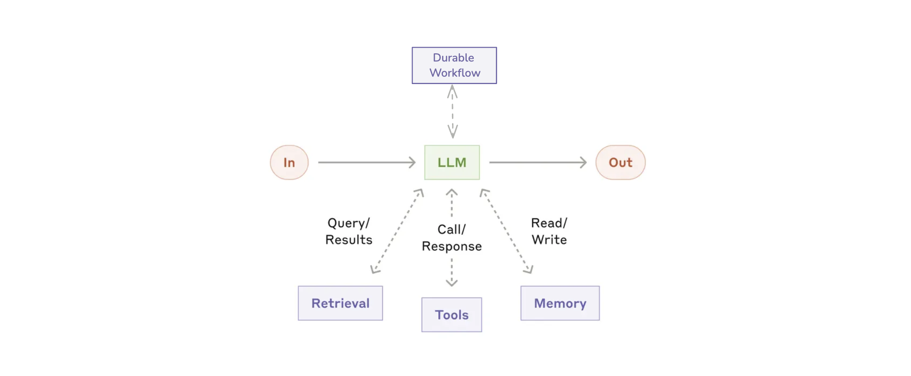

# Stateful LLM Pattern

## Pattern Overview

The Stateful LLM pattern extends the Augmented LLM pattern by adding persistence, reliability, and workflow capabilities. This pattern enables LLMs to maintain state across sessions and handle long-running operations that can survive system restarts. Using Dapr's state management and workflow orchestration, the agent can pick up where it left off even after being shut down.



## Use Cases

- **Mission-Critical Applications**: Where reliability and fault tolerance are essential
- **Long-Running Tasks**: Operations that may take minutes, hours, or days to complete
- **Distributed Systems**: Applications running across multiple services or regions
- **Customer Support**: Handling complex multi-session support tickets that might span days
- **Business Processes**: Implementing business workflows with LLM intelligence at each step
- **Complaint Resolution**: Managing multi-stage resolution processes that require different departments

## Dapr Agent Implementation

This example demonstrates a stateful travel planning assistant that:
1. Remembers user context persistently (across restarts)
2. Uses a tool to search for flight options
3. Exposes a REST API for workflow interaction
4. Stores execution state in Dapr state stores

The implementation uses the Dapr Agents framework with Dapr's state management and workflow capabilities to create a resilient, stateful LLM agent.

## Setup

```bash
# Create a virtual environment
python3.10 -m venv .venv

# Activate the virtual environment 
# On Windows:
.venv\Scripts\activate
# On macOS/Linux:
source .venv/bin/activate

# Install dependencies
pip install -r requirements.txt
```

Set up your environment variables:

```bash
# Create .env file with your API key
echo "OPENAI_API_KEY=your_api_key_here" > .env
```

Make sure Dapr is installed, then run:

```bash
# Start the agent with Dapr
dapr run --app-id stateful-llm --app-port 8001 --dapr-http-port 3500 --resources-path components/ -- python 02_stateful_llm.py
```

## Interacting with the Agent

Unlike the simple agent in example 01, this stateful agent exposes a REST API for workflow interactions:

### Start a new workflow:

```bash
curl -i -X POST http://localhost:8001/start-workflow \
  -H "Content-Type: application/json" \
  -d '{"task": "I want to find flights to Paris"}'
```

You'll receive a workflow ID in response, which you can use to track progress.

### Check workflow status:

```bash
# Replace WORKFLOW_ID with the ID from the previous response
curl -i -X GET http://localhost:3500/v1.0/workflows/durableTaskHub/WORKFLOW_ID
```

### Monitor progress in real-time:

```bash
watch -n 2 'curl -s -X GET http://localhost:3500/v1.0/workflows/durableTaskHub/WORKFLOW_ID'
```

### Direct message to the agent:

```bash
curl -X POST http://localhost:3500/v1.0/publish/messagepubsub/TravelBuddy \
  -H "Content-Type: application/json" \
  -d '{
    "data": {
      "text": "Find me flights to Paris",
      "sender": "user123"
    }
  }'
```

## How It Works

The key components of this Stateful LLM pattern implementation are:

1. **Persistent Memory**: The agent stores conversation state in Dapr's state store, enabling it to remember context across sessions and system restarts.

2. **Workflow Orchestration**: Long-running tasks are managed through Dapr's workflow system, providing:
    - Durability - workflows survive process crashes
    - Observability - track status and progress
    - Recoverability - automatic retry on failures

3. **Tool Integration**: A flight search tool is defined using the `@tool` decorator, which automatically handles input validation and type conversion.

4. **Service Exposure**: The agent exposes REST endpoints to start and manage workflows.

This implementation demonstrates the core value of the Stateful LLM pattern: enhancing an LLM with persistence and reliability features for production-grade applications.

## Key Differences from Augmented LLM Pattern

- **Persistence**: State survives across restarts, unlike the in-memory state of basic agents
- **Reliability**: Automatic failure recovery and retry mechanisms
- **API Access**: REST endpoints for workflow management
- **Observability**: Ability to track and monitor workflow progress
- **Durability**: Can handle long-running tasks spanning minutes, hours, or days

## References

- [Anthropic: Building Effective Agents](https://www.anthropic.com/research/building-effective-agents)
- [Dapr Agents Documentation](https://dapr.github.io/dapr-agents/)
- [Dapr Workflow Documentation](https://docs.dapr.io/developing-applications/building-blocks/workflow/)