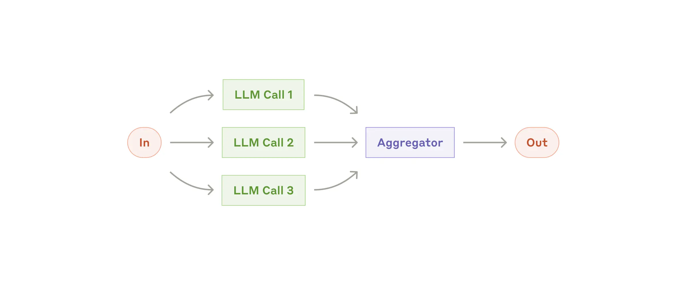

# Parallelization Pattern

## Pattern Overview

The Parallelization pattern allows LLMs to work simultaneously on different aspects of a task, with outputs aggregated programmatically. This pattern manifests in two key variations: sectioning (breaking tasks into independent subtasks) and voting (running the same task multiple times for consensus).



## Use Cases

- **Complex Research**: Processing different aspects of a research topic simultaneously
- **Content Creation**: Generating multiple sections of a document in parallel
- **Decision Making**: Collecting multiple perspectives on the same problem (voting)
- **Multi-faceted Planning**: Creating various elements of a plan concurrently
- **Product Analysis**: Analyzing different aspects of a product in parallel

## Dapr Agent Implementation

This example demonstrates a travel planning workflow that:
1. Takes a user's travel request as input
2. Processes three aspects in parallel:
   - Attractions research
   - Accommodation recommendations
   - Transportation options
3. Aggregates the results into a comprehensive travel plan

The implementation uses the Dapr Agents framework to coordinate parallel execution of LLM tasks and to combine their results into a final output.

## Setup

```bash
# Create a virtual environment
python3.10 -m venv .venv

# Activate the virtual environment 
# On Windows:
.venv\Scripts\activate
# On macOS/Linux:
source .venv/bin/activate

# Install dependencies
pip install -r requirements.txt
```

Set up your environment variables:

```bash
# Create .env file with your API key
echo "OPENAI_API_KEY=your_api_key_here" > .env
```

Run the example:

```bash
# Run with Dapr
dapr run --app-id parallelization --resources-path components/ -- python 05_parallelization.py
```

## How It Works

The key components of this Parallelization pattern implementation are:

1. **Parallel Task Definition**: Three independent LLM tasks are defined to process different aspects of the travel planning problem.

2. **Workflow Orchestration**: The Dapr workflow engine coordinates the parallel execution of these tasks, handling synchronization and aggregation.

3. **Result Aggregation**: Once all parallel tasks complete, their outputs are combined into a comprehensive travel plan by a final LLM call.

4. **Structured Data Models**: Pydantic models define the structure of travel components, ensuring consistency across parallel tasks.

This implementation demonstrates the core value of the Parallelization pattern: improved efficiency through concurrent processing of independent subtasks, with programmatic aggregation of results.

## When to Use This Pattern

This pattern is ideal when:
- Tasks can be divided into independent subtasks
- You need to process multiple aspects of a problem simultaneously
- Speed is important, and parallelization can reduce overall latency
- You want multiple perspectives on the same problem (voting variation)
- Complex tasks benefit from focused attention on different aspects

## References

- [Anthropic: Building Effective Agents](https://www.anthropic.com/research/building-effective-agents)
- [Dapr Agents Documentation](https://dapr.github.io/dapr-agents/)