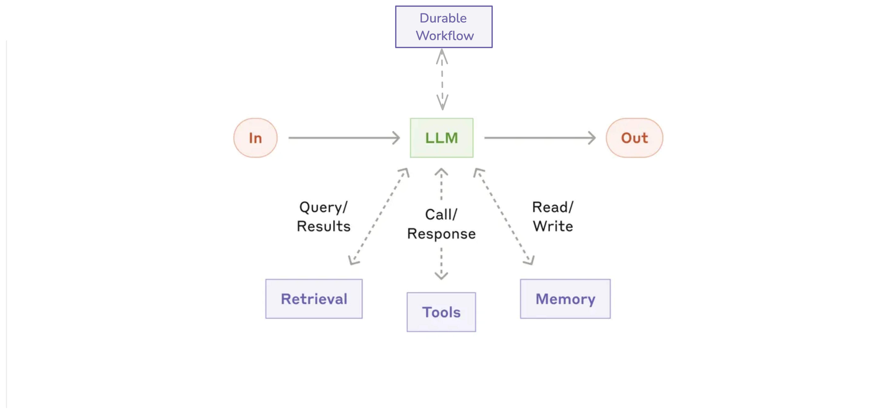

# Building Effective Dapr Agents

This repository demonstrates implementations of various agent patterns based on Anthropic's research paper [Building Effective Agents](https://www.anthropic.com/research/building-effective-agents). The paper highlights how successful implementations use simple, composable patterns rather than complex frameworks.

These examples show how to implement each pattern using the [Dapr Agents framework](https://dapr.github.io/dapr-agents/), which provides a clean, production-ready approach to building agent systems.

## Prerequisites

- Python 3.10+
- Dapr CLI installed
- OpenAI API key

## Setup

```bash
# Create a virtual environment
python3.10 -m venv .venv

# Activate the virtual environment 
# On Windows:
.venv\Scripts\activate
# On macOS/Linux:
source .venv/bin/activate

# Install dependencies
pip install -r requirements.txt

# Set up your API key
echo "OPENAI_API_KEY=your_api_key_here" > .env
```

## Patterns Overview

This repository includes implementations of the following patterns:

1. **Augmented LLM**: The basic building block enhanced with memory and tools
2. **Stateful LLM**: Adding persistence and reliability to LLM agents
3. **Prompt Chaining**: Breaking complex tasks into sequential steps
4. **Parallelization**: Processing multiple aspects of a task simultaneously
5. **Routing**: Directing inputs to specialized handlers
6. **Orchestrator-Workers**: Dynamically planning and delegating subtasks
7. **Evaluator-Optimizer**: Iterative improvement through feedback loops
8. **Autonomous Agent**: Self-directed reasoning and tool usage

## 1. Augmented LLM Pattern

### Pattern Overview

The Augmented LLM pattern is a foundational building block for agentic systems. It enhances a language model with external capabilities such as memory, tools, and retrieval systems. This pattern enables LLMs to overcome their inherent limitations by connecting them to the outside world, allowing them to remember context across interactions and access external data or services.


### Use Cases

- **Personal Assistants**: Remembering user preferences and accessing calendars, emails, or other personal data
- **Customer Support**: Retrieving product information or account details to provide accurate assistance
- **Research Tools**: Searching and retrieving information from databases or knowledge bases
- **Domain-Specific Applications**: Connecting to specialized tools like calculators, data analyzers, or external APIs

### Implementation

This example demonstrates a simple travel planning assistant that:
1. Remembers user context (desired travel destination)
2. Uses a tool to search for flight options to that destination

Run the example:

```bash
python 01_augmented_llm.py
```

### How It Works

The key components of this implementation are:

1. **Memory**: The agent automatically maintains conversation history, allowing it to remember that the user wants to visit Paris.

2. **Tool Integration**: A flight search tool is defined using the `@tool` decorator, which automatically handles:
    - Input validation with Pydantic models
    - Type conversion
    - Structured output formatting

3. **Agent Configuration**: The agent is configured with:
    - A specific role ("Travel Planner Assistant")
    - Instructions that guide its behavior
    - Access to the defined tools

## 2. Stateful LLM Pattern

### Pattern Overview

The Stateful LLM pattern extends the Augmented LLM pattern by adding persistence, reliability, and workflow capabilities. This pattern enables LLMs to maintain state across sessions and handle long-running operations that can survive system restarts.



### Use Cases

- **Mission-Critical Applications**: Where reliability and fault tolerance are essential
- **Long-Running Tasks**: Operations that may take minutes, hours, or days to complete
- **Distributed Systems**: Applications running across multiple services or regions
- **Customer Support**: Handling complex multi-session support tickets that might span days
- **Business Processes**: Implementing business workflows with LLM intelligence at each step

### Implementation

This example demonstrates a stateful travel planning assistant that:
1. Remembers user context persistently (across restarts)
2. Uses a tool to search for flight options
3. Exposes a REST API for workflow interaction
4. Stores execution state in Dapr state stores

Run the example:

```bash
# Start the agent with Dapr
dapr run --app-id stateful-llm --app-port 8001 --dapr-http-port 3500 --resources-path components/ -- python 02_stateful_llm.py
```

### Interacting with the Agent

Unlike the simple agent in example 01, this stateful agent exposes a REST API for workflow interactions:

#### Start a new workflow:

```bash
curl -i -X POST http://localhost:8001/start-workflow \
  -H "Content-Type: application/json" \
  -d '{"task": "I want to find flights to Paris"}'
```

You'll receive a workflow ID in response, which you can use to track progress.

#### Check workflow status:

```bash
# Replace WORKFLOW_ID with the ID from the previous response
curl -i -X GET http://localhost:3500/v1.0/workflows/durableTaskHub/WORKFLOW_ID
```

#### Monitor progress in real-time:

```bash
watch -n 2 'curl -s -X GET http://localhost:3500/v1.0/workflows/durableTaskHub/WORKFLOW_ID'
```

#### Direct message to the agent:

```bash
curl -X POST http://localhost:3500/v1.0/publish/messagepubsub/TravelBuddy \
  -H "Content-Type: application/json" \
  -d '{
    "data": {
      "text": "Find me flights to Paris",
      "sender": "user123"
    }
  }'
```

### How It Works

The key components of this implementation are:

1. **Persistent Memory**: The agent stores conversation state in Dapr's state store, enabling it to remember context across sessions and system restarts.

2. **Workflow Orchestration**: Long-running tasks are managed through Dapr's workflow system, providing:
    - Durability - workflows survive process crashes
    - Observability - track status and progress
    - Recoverability - automatic retry on failures

3. **Tool Integration**: A flight search tool is defined using the `@tool` decorator, which automatically handles input validation and type conversion.

4. **Service Exposure**: The agent exposes REST endpoints to start and manage workflows.

## 3. Prompt Chaining Pattern

### Pattern Overview

The Prompt Chaining pattern decomposes a complex task into a sequence of steps, where each LLM call processes the output of the previous one. This pattern allows for breaking down complex tasks into simpler, more manageable steps with validation gates between them.


### Use Cases

- **Content Generation**: Creating outlines first, then expanding to full documents
- **Multi-stage Analysis**: Breaking complex analysis into sequential steps
- **Quality Assurance Workflows**: Adding validation between processing steps
- **Translation Services**: First understanding content, then translating with context
- **Planning Systems**: Creating high-level plans before detailed implementation

### Implementation

This example demonstrates a travel planning workflow that:
1. Extracts the destination from user input (using simple prompt)
2. Validates the destination with a gate function
3. Generates a travel outline (using agent with tools)
4. Expands the outline into a detailed itinerary (using agent without tools)

Run the example:

```bash
# Run with Dapr
dapr run --app-id prompt-chaining --resources-path components/ -- python 03_chaining.py
```

### How It Works

The key components of this implementation are:

1. **Sequential Tasks**: The workflow chains multiple LLM operations together, with each building on the previous step's output.

2. **Validation Gate**: A simple check ensures the extracted destination is valid before proceeding to more complex (and costly) operations.

3. **Multiple Execution Types**:
    - Simple prompt (destination extraction): Uses a basic prompt without an agent
    - Planning agent (outline creation): Uses an agent with tools for attraction search
    - Itinerary agent (detail expansion): Uses an agent without tools for creative content generation

4. **Tool Integration**: The planning agent uses a tool to search for attractions based on type.

## 4. Parallelization Pattern

### Pattern Overview

The Parallelization pattern allows LLMs to work simultaneously on different aspects of a task, with outputs aggregated programmatically. This pattern manifests in two key variations: sectioning (breaking tasks into independent subtasks) and voting (running the same task multiple times for consensus).


### Use Cases

- **Complex Research**: Processing different aspects of a research topic simultaneously
- **Content Creation**: Generating multiple sections of a document in parallel
- **Decision Making**: Collecting multiple perspectives on the same problem (voting)
- **Multi-faceted Planning**: Creating various elements of a plan concurrently
- **Product Analysis**: Analyzing different aspects of a product in parallel

### Implementation

This example demonstrates a travel planning workflow that:
1. Takes a user's travel request as input
2. Processes three aspects in parallel:
    - Attractions research
    - Accommodation recommendations
    - Transportation options
3. Aggregates the results into a comprehensive travel plan

Run the example:

```bash
# Run with Dapr
dapr run --app-id parallelization --resources-path components/ -- python 04_parallelization.py
```

### How It Works

The key components of this implementation are:

1. **Parallel Task Definition**: Three independent LLM tasks are defined to process different aspects of the travel planning problem.

2. **Workflow Orchestration**: The Dapr workflow engine coordinates the parallel execution of these tasks, handling synchronization and aggregation.

3. **Result Aggregation**: Once all parallel tasks complete, their outputs are combined into a comprehensive travel plan by a final LLM call.

4. **Structured Data Models**: Pydantic models define the structure of travel components, ensuring consistency across parallel tasks.

## 5. Routing Pattern

### Pattern Overview

The Routing pattern classifies an input and directs it to a specialized followup task. This pattern enables separation of concerns, allowing each specialized handler to focus on a specific type of input without the complexity of handling all possible cases.


### Use Cases

- **Customer Support**: Directing different types of queries (refunds, technical help, general questions) to specialized agents
- **Content Creation**: Routing writing tasks to topic specialists (finance, tech, healthcare)
- **Resource Optimization**: Sending simple queries to smaller, faster models and complex ones to more capable models
- **Multi-lingual Support**: Routing queries to language-specific handlers
- **Hybrid LLM Systems**: Using different models for different tasks based on their strengths

### Implementation

This example demonstrates a travel assistant that:
1. Takes a user's travel query as input
2. Classifies the query into one of three categories:
    - Attractions (sightseeing, activities)
    - Accommodations (hotels, rentals)
    - Transportation (getting around, travel logistics)
3. Routes the query to a specialized handler optimized for that category
4. Returns a detailed response from the appropriate specialist

Run the example:

```bash
# Run with Dapr
dapr run --app-id routing --resources-path components/ -- python 05_routing.py
```

### How It Works

The key components of this implementation are:

1. **Query Classification**: An LLM-based router analyzes the input query and determines its category using a structured output format (RoutingDecision).

2. **Specialized Handlers**: Three task handlers with optimized prompts focus on different travel domains:
    - Attractions handler: Optimized for questions about sights and activities
    - Accommodations handler: Specialized for hotel and lodging inquiries
    - Transportation handler: Focused on travel logistics questions

3. **Workflow Orchestration**: The Dapr workflow engine manages the process flow:
    - First sending the query to the classifier
    - Then routing to the appropriate specialized handler
    - Finally returning the response to the user

## 6. Orchestrator-Workers Pattern

### Pattern Overview

The Orchestrator-Workers pattern features a central orchestrator LLM that dynamically breaks down tasks, delegates them to worker LLMs, and synthesizes their results.


### Use Cases

- **Complex Travel Planning**: Creating comprehensive travel itineraries with multiple components
- **Software Development**: Making changes across multiple files based on requirements
- **Research Tasks**: Gathering and analyzing information from multiple sources
- **Business Analysis**: Evaluating different facets of a complex problem
- **Content Creation**: Combining specialized content from various domains

### Implementation

This example demonstrates a travel planning workflow that:
1. Takes a complex travel request as input
2. Uses an orchestrator LLM to analyze the request and determine required subtasks
3. Dispatches each subtask to worker LLMs that handle specific aspects of the travel plan
4. Uses a synthesizer LLM to combine all worker outputs into a comprehensive travel plan

Run the example:

```bash
# Run with Dapr
dapr run --app-id orchestrator --resources-path components/ -- python 06_orchestrator.py
```

### How It Works

The key components of this implementation are:

1. **Dynamic Task Planning**: An orchestrator LLM analyzes the input and dynamically creates a plan of subtasks, each defined with a clear objective.

2. **Specialized Workers**: Each subtask is assigned to a worker LLM that focuses on solving just that specific aspect of the problem.

3. **Result Synthesis**: Once all workers complete their tasks, their outputs are combined by a synthesizer LLM into a cohesive final result.

4. **Flexible Architecture**: Unlike patterns with fixed workflows, this pattern adapts to each input by creating custom task plans.

## 7. Evaluator-Optimizer Pattern

### Pattern Overview

The Evaluator-Optimizer pattern features two complementary LLM roles in a feedback loop: one generates content while another evaluates it, leading to iterative improvements until quality criteria are met.


### Use Cases

- **Content Creation**: Refining written content to match specific style guidelines or quality standards
- **Translation**: Improving literary translations that require nuanced understanding and expression
- **Code Generation**: Creating code that meets specific requirements and handles edge cases
- **Complex Search**: Multi-round information gathering and refinement
- **Travel Planning**: Creating detailed itineraries that meet traveler preferences

### Implementation

This example demonstrates an iterative travel planning workflow that:
1. Takes a travel request as input
2. Uses a generator LLM to create an initial travel plan
3. Uses an evaluator LLM to assess the plan and provide specific feedback
4. Iteratively improves the plan based on evaluation feedback
5. Terminates when the plan meets quality criteria or reaches maximum iterations

Run the example:

```bash
# Run with Dapr
dapr run --app-id evaluator-optimizer --resources-path components/ -- python 07_evaluator.py
```

### How It Works

The key components of this implementation are:

1. **Generator LLM**: Creates or refines content based on input requirements and feedback
2. **Evaluator LLM**: Analyzes content against specific criteria and provides structured feedback
3. **Feedback Loop**: Enables multiple rounds of generation and evaluation
4. **Quality Criteria**: Defines when the process should terminate with measurable metrics

## 8. Autonomous Agent Pattern

### Pattern Overview

The Autonomous Agent pattern features an LLM that dynamically directs its own processes and tool usage, maintaining control over how it accomplishes tasks through an iterative reasoning-action-observation loop.


### Use Cases

- **Travel Planning**: Gathering information and providing personalized recommendations
- **Customer Support**: Resolving complex issues through information gathering and problem-solving
- **Research Assistant**: Finding and synthesizing information from multiple sources
- **Software Development**: Debugging and fixing issues across codebases
- **Personal Assistant**: Handling scheduling, reminders, and information lookup tasks

### Implementation

This example demonstrates a simple travel assistant that:
1. Takes a travel query as input
2. Uses the ReAct (Reasoning-Action) framework to determine what information is needed
3. Dynamically decides which tools to call and in what order
4. Synthesizes gathered information into a comprehensive response

Run the example:

```bash
# Run with Dapr
dapr run --app-id agent --resources-path components/ -- python 08_agent.py
```

### How It Works

The key components of this implementation are:

1. **ReAct Framework**: The agent follows a structured [Reasoning-Action-Observation](https://arxiv.org/abs/2210.03629) loop:
    - **Thought**: The agent reasons about what information is needed
    - **Action**: The agent calls a tool to gather information
    - **Observation**: The agent processes the tool's response
    - **Repeat**: The cycle continues until sufficient information is gathered

2. **Tool Integration**: The agent has access to simple tools:
    - Weather information for cities
    - Activity recommendations for popular destinations

3. **Self-Directed Process**: Unlike other patterns, the agent itself decides:
    - Which tools to use
    - In what order to call them
    - When it has sufficient information to respond

## References

- [Anthropic: Building Effective Agents](https://www.anthropic.com/research/building-effective-agents)
- [Dapr Agents Documentation](https://dapr.github.io/dapr-agents/)
